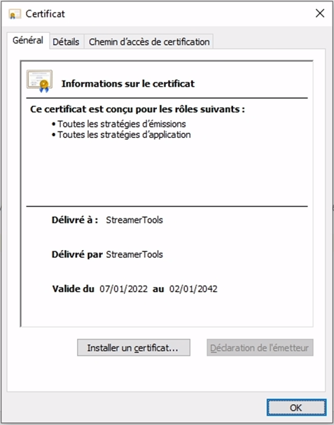
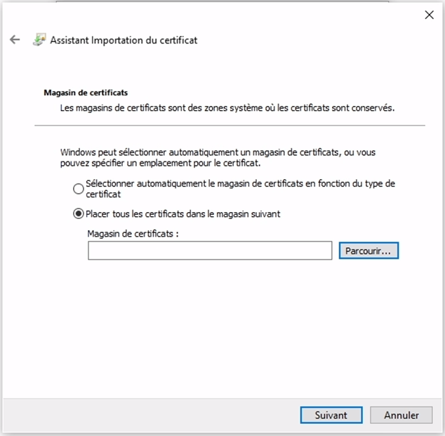
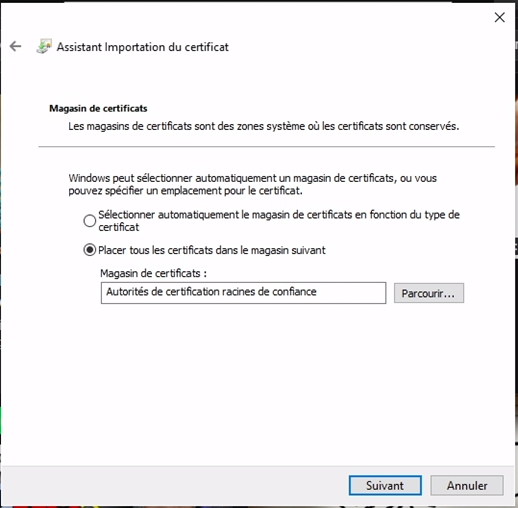
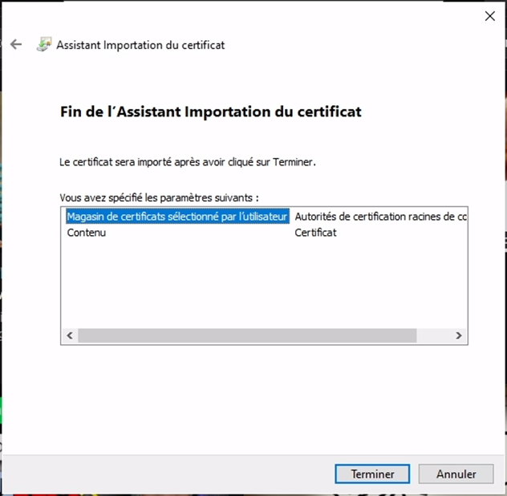
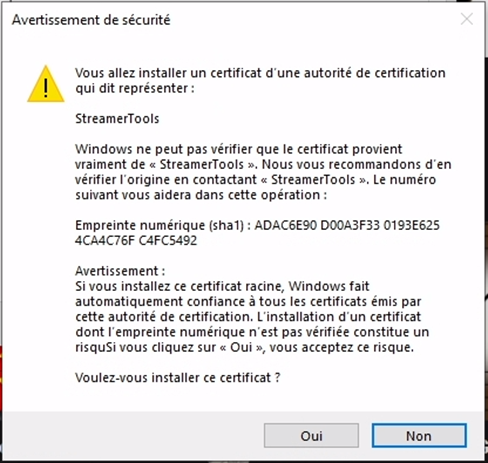
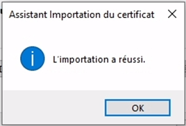
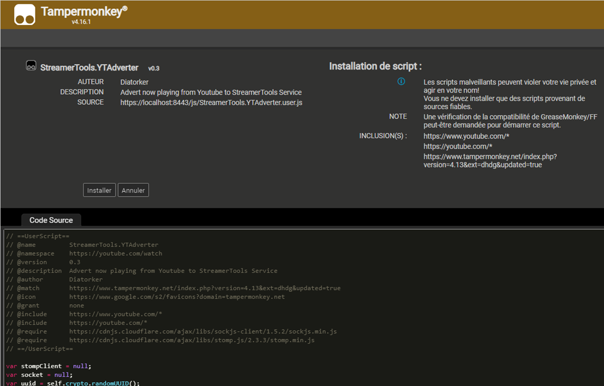

# Installation
## Installation du certificat
Pour que le service fonctionne correctement, il est nécessaire d’installer un certificat dans la machine.
Pour cela, ouvrez le fichier StreamerTools-Service.crt


Cliquez sur _Installer un certificat..._



Sélectionnez _Utilisateur local_ puis cliquez sur _Suivant_


Sélectionnez _Placer tous les certificats dans le magasin suivant_ puis cliquez sur _Parcourir..._



Sélectionnez _Autorités de certification racines de confiance_ puis cliquez sur _OK_


Cliquez sur _Suivant_



Cliquez sur _Terminer_



Acceptez l’avertissement de sécurité en cliquant sur Oui.  
Le certificat que nous installons permet au service StreamerTools d’être automatiquement reconnus par les navigateurs web. Il est nécessaire pour qu’OBS charge l’affichage du widget et pour que les données puissent être envoyé depuis l’onglet Youtube. Ce certificat n’est valide que pour localhost et reste donc plutôt sûr.



Le certificat est importé.



## Installation du script de surveillance Youtube
Pour obtenir les informations sur la vidéo Youtube en cours de lecture, il est nécessaire d’installer un userscript, un script javascript chargé par une extension dans les pages Youtube.  
Tout d’abord, installez l’extension Chrome Tampermonkey (Stable) : https://www.tampermonkey.net


Une fois l’extension installée, accédez au lien : https://localhost:8443/js/StreamerTools.YTAdverter.user.js   
Tampermonkey devrait s’ouvrir et vous proposer d’installer le userscript du Youtube Adverter. Cliquez sur Installer.



## Installation de Java 11
Streamer Tools fonctionne avec java 11.  
Vous pouvez le télécharger en suivant le lien suivant : https://adoptium.net/?variant=openjdk11 

## Démarrage de StreamerTools
Pour utiliser l’outil, ouvrez le fichier start-streamertools.bat  
Une interface de commande s’ouvre et le service démarre. Lorsque vous voyez les lignes ci-dessous, tout est prêt.  

```
Started StreamerToolsApplication in 2.411 seconds (JVM running for 2.749)
Completed initialization in 0 ms
```
