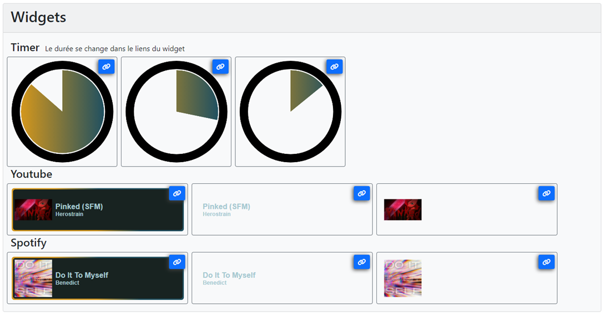
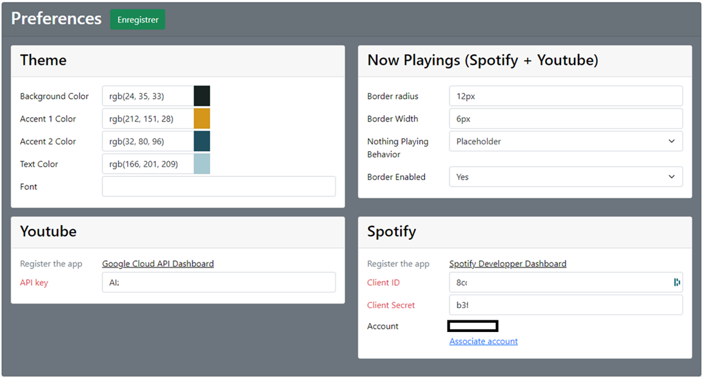

# Personnalisation
Streamer Tools est doté d’une interface présentant l’ensemble des widgets de Streamer Tools, et permettant la 
configuration du thème utilisé, et des différents widgets et intégration.  
Vous pouvez y accéder en suivant le lient https://localhost:8443. 

Dans la partie supérieure, vous trouverez l’ensemble des widgets supportés.  

Dans la partie inférieure, vous trouverez l’ensemble des paramètres de StreamerTools.  

## Section Theme
| Paramètre        | Description                        | Utilisé dans            |
|------------------|------------------------------------|-------------------------|
| Background Color | Couleur de fond de certains widget | Youtube, Spotify        |
| Accent 1 Color   | Couleur de thème numéro 1          | Youtube, Spotify, Timer |
| Accent 2 Color   | Couleur de thème numéro 2          | Youtube, Spotify, Timer |
| Text Color       | Couleur du texte                   | Youtube, Spotify        |
| Font             | Police du texte                    | Youtube, Spotify        |

## Section Now Playings
Cette section s’applique aux widgets de lecture en cours (Spotify, Youtube)

| Paramètre                | Description                                                                                                                                                          | Utilisé dans     |
|--------------------------|----------------------------------------------------------------------------------------------------------------------------------------------------------------------|------------------|
| Border radius            | Rayon d’arrondis du widget.  (Dimension CSS, Ex. : 12px)                                                                                                             | Youtube, Spotify |
| Border Width             | Épaisseur de la bordure.  (Dimension CSS, Ex. : 6px)                                                                                                                 | Youtube, Spotify |
| Nothing Playing Behavior | Comportement lorsqu’il n’y a pas de lecture en cours :  - Placeholder : widget présent, pas de texte, image de remplacement   - Hidden : le widget disparaît | Youtube, Spotify |
| Border Enabled           | Active ou désactive le fond et le bord du widget                                                                                                                     | Youtube, Spotify |

## Section Youtube
Cette section s’applique aux widgets de lecture en cours (Spotify, Youtube)

| Paramètre | Description                                                                                                                                                        | Utilisé dans |
|-----------|--------------------------------------------------------------------------------------------------------------------------------------------------------------------|--------------|
| API key   | Clé d’API permettant de récupérer les informations sur la vidéo youtube.   **Il faut redémarrer Streamer Tools pour prendre en compte le changement de clé d’API** | Youtube      |

## Section Spotify
Cette section s’applique aux widgets de lecture en cours (Spotify, Youtube)

| Paramètre     | Description                                                                                                                                                                                                   | Utilisé dans |
|---------------|---------------------------------------------------------------------------------------------------------------------------------------------------------------------------------------------------------------|--------------|
| Client ID     | Client ID pour authentifier Streamer Tools avec l’API Spotify.   **Il faut redémarrer Streamer Tools pour prendre en compte le changement de Client ID**                                                      | Spotify      |
| Client Secret | Client Secret pour authentifier Streamer Tools avec l’API Spotify.   **Il faut redémarrer Streamer Tools pour prendre en compte le changement de Client Secret**                                              | Spotify      |
| Account       | Le compte Spotify suivis par Streamer Tool. Cliquez sur Associate Account pour associez le compte Spotify connectez à votre navigateur. Le Client ID et le Client Secret doivent être correctement renseignés | Spotify      |

## Section Twitch
Cette section s’applique aux widgets Twitch

| Paramètre                   | Description                                                                                                                    | Utilisé dans                      |
|-----------------------------|--------------------------------------------------------------------------------------------------------------------------------|-----------------------------------|
| ID Chaine                   | ID numérique de la chaine Twitch.   **Il faut redémarrer Streamer Tools pour prendre en compte le changement d'ID Chaine** | Twitch/Poll Twitch/Prediction |
| Temps Maintiens Widgets     | C'est le temps en seconde pendant lequel les widgets resteront affichés une fois un évènement terminé                          | Twitch/Poll Twitch/Prediction |
| Couleur du texte des choix  | Couleur utilisé pour le texte et la bordure des choix                                                                          | Twitch/Poll Twitch/Prediction |
| Couleur de fond des choix   | Couleur utilisé pour la barre de progression des choix                                                                         | Twitch/Poll Twitch/Prediction |
| Prédi. avec couleurs Tiwtch | Si oui la couleur de fond utilisé pour le choix des prédictions utilise le thème de couleur de Twitch (Rose et Bleu).          | Twitch/Prediction                 |
