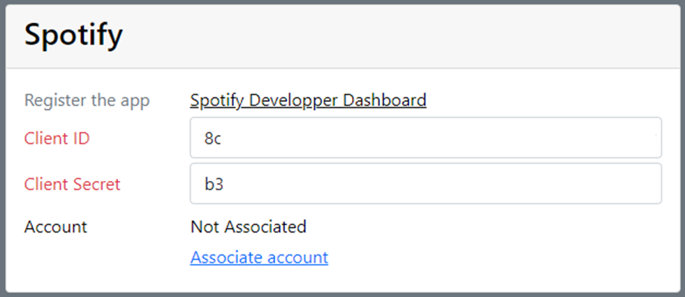
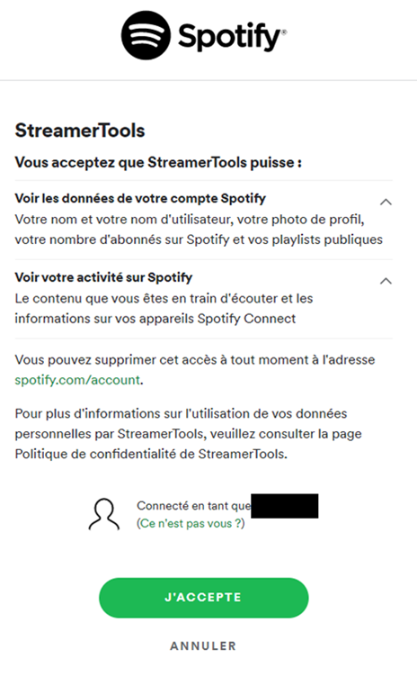
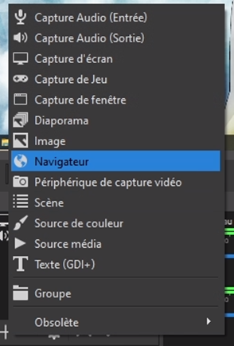
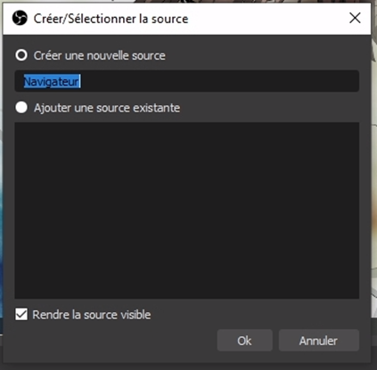
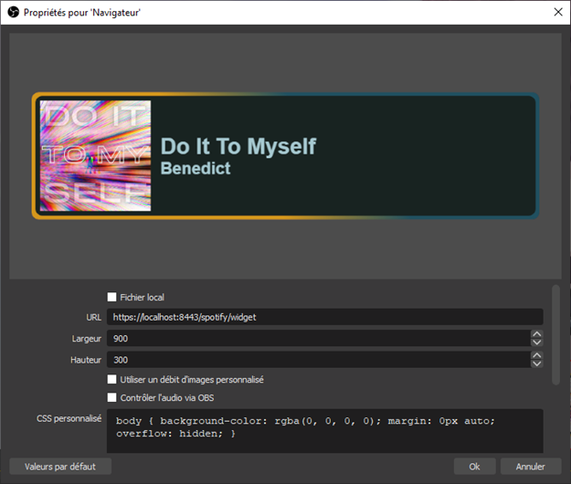
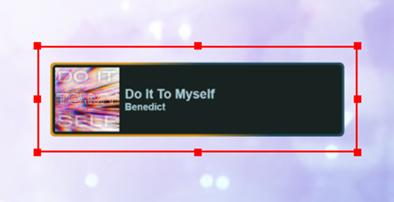

# Spotify
Le widget est connecté à l’API de Spotify. Il suffit de lancer une musique depuis n’importe quel appareil et le widget 
reflètera la piste en train d’être lu.

Lorsque la lecture est en pause, le widget n’affiche pas le nom du titre en cours.

## Enregistrez StreamerTools sur Spotify
Vous pouvez suivre le tutoriel suivant pour enregistrer l’application sur Spotify

Dans l’étape 5, utilisez :  
Redirect URI : `https://localhost:8443/spotify/redirect-back`  
Website : `https://github.com/Diatorker/StreamerTools`

https://support.heateor.com/get-spotify-client-id-client-secret/ 

Récupérez le Client ID et le Client Secret et enregistrez-les dans les paramètres de StreamerTools

## Autorisation Spotify
Avant tout usage, vous devez autoriser Streamer Tools à accéder à votre compte Spotify. Pour cela, accédez à la page 
d’accueil de StreamerTools https://localhost:8443/, puis dans la section _Préférences > Spotify_, cliquez sur le lien 
**Associate Account**  

Acceptez les autorisations pour StreamerTools.  

L’autorisation a été accordé. Le nom du compte apparaît dans les préférences.

## Ajout du widget Youtube-NP à OBS
Dans OBS, ajoutez une source Navigateur.  

  
Saisissez l’URL : `https://localhost:8443/spotify/widget`

Les dimensions sont peu importantes. Le fond étant transparent, vous pourrez placer le widget facilement sur vos scènes.  

Le widget est chargé et se met à jour automatiquement !  

## Troubleshooting
Si le widget ne réagit pas, vérifiez l’état de l’autorisation en accédant à https://localhost:8443/