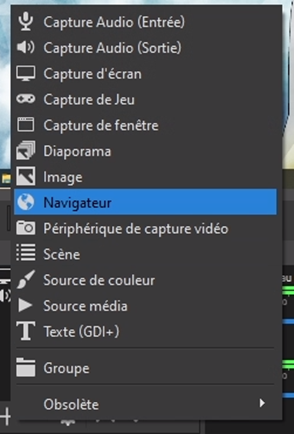
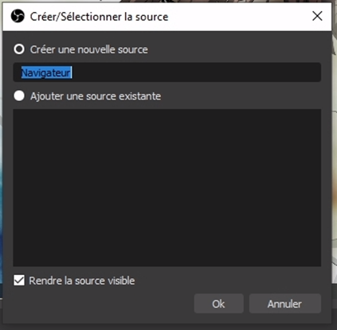
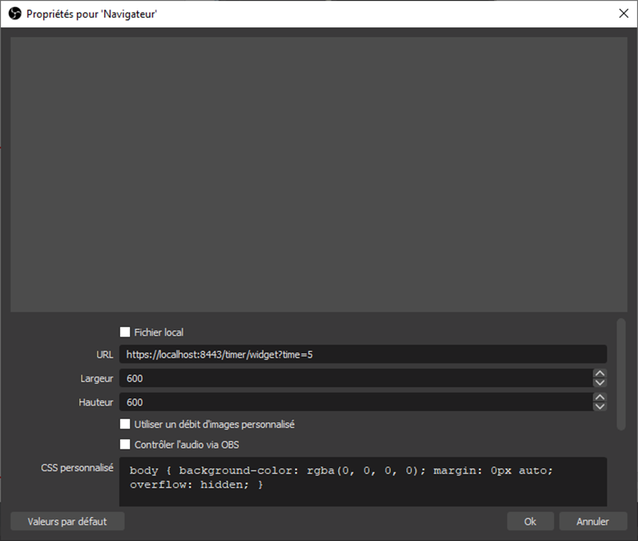
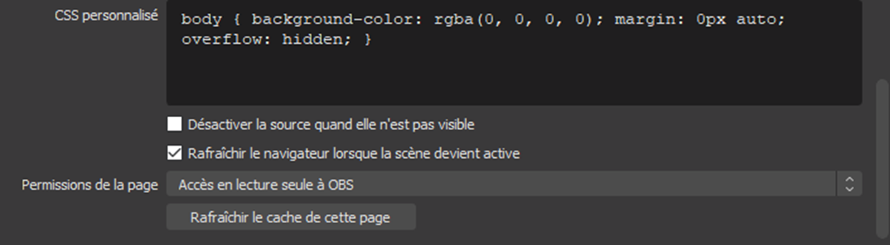
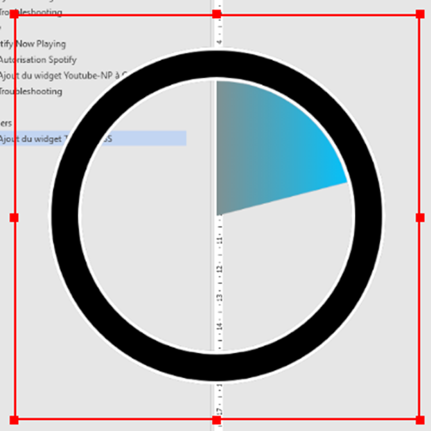

# Timer
## Ajout du widget Timer à OBS
Dans OBS, ajoutez une source Navigateur.  

  
Saisissez l’URL en définissant la durée du Timer en secondes : `https://localhost:8443/timer/widget?time=[temps-en-s]`

Les dimensions doivent être supérieur à 500x500. Le fond étant transparent, vous pourrez placer le widget facilement sur
vos scènes.

Par exemple pour un timer de 5s :  

 
Plus bas, cochez la case _Rafraîchir le navigateur lorsque la scène devient active_ pour pouvoir réarmer le Timer au 
prochain affichage.  

 
À l’affichage du widget, le Timer commence. Il disparaîtra automatiquement une fois que le temps est écoulé.  

 
