# Twitch
Le widget est connecté au chat Twitch. Tant que StreamerTools est ouvert, il suivra 
les évènements *poll* et *prediction* de votre chaine pour vous permettre d'afficher 
les résultats en temps réel sur votre stream. 

Le widget disparait automatiquement une fois l'évènement terminé. Les résultats sont 
également affichés dans la console StreamerTools si jamais vous les avez loupés !

*Attention !* Si vous redémarrez StreamerTools pendant un évènement, vous devrez 
attendre un vote pour que StreamerTools récupère les informations de l'évènement en
cours.

## Suivre votre chaine via StreamerTools
Afin de suivre votre chaine, StreamerTools à besoin de l'ID Twitch de votre chaine. 
Cet ID n'est pas visible depuis le site web de Twitch. Vous pouvez utiliser le site 
suivant pour trouver l'ID de votre chaine : https://streamscharts.com/tools/convert-username

Une fois l'ID obtenu, il vous suffit de le saisir dans la section Twitch de l'outil 
de configuration de StreamerTools.
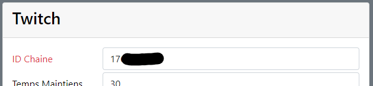

## Ajout du widget Twitch Poll à OBS
Dans OBS, ajoutez une source Navigateur.  

En fonction de la manière selon laquelle vous souhaitez que le widget grandisse utilisez
l'URL suivante correspondante :
- Dans toutes les directions : `https://localhost:8443/twitch/poll?pos=center`
  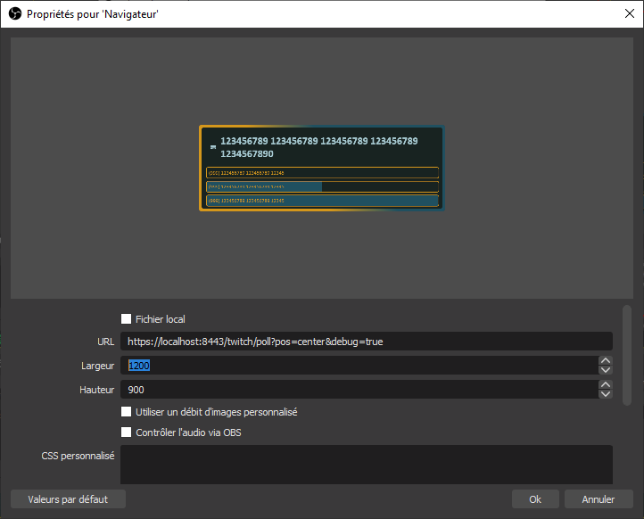
- Collez en haut et grandis en bas : `https://localhost:8443/twitch/poll?pos=top`
  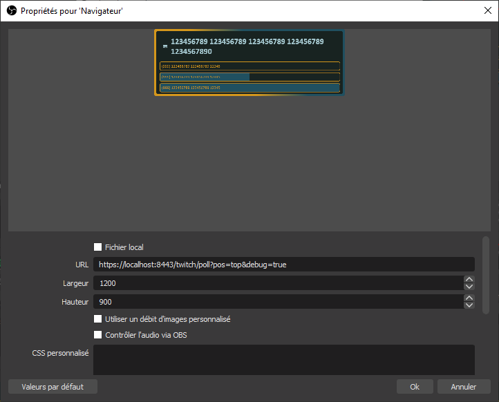
- Collez à droite et grandis vers la gauche : `https://localhost:8443/twitch/poll?pos=right`
  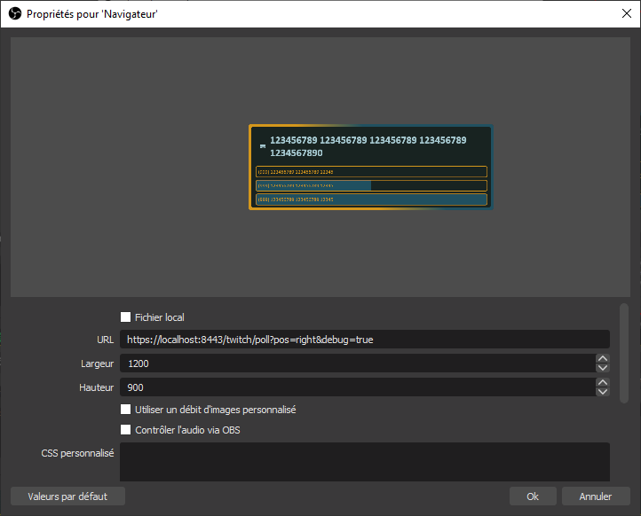
- Collez en bas et grandis en haut : `https://localhost:8443/twitch/poll?pos=bottom`
  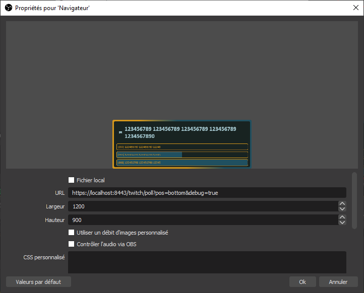
- Collez à gauche et grandis vers la droite : `https://localhost:8443/twitch/poll?pos=left`
  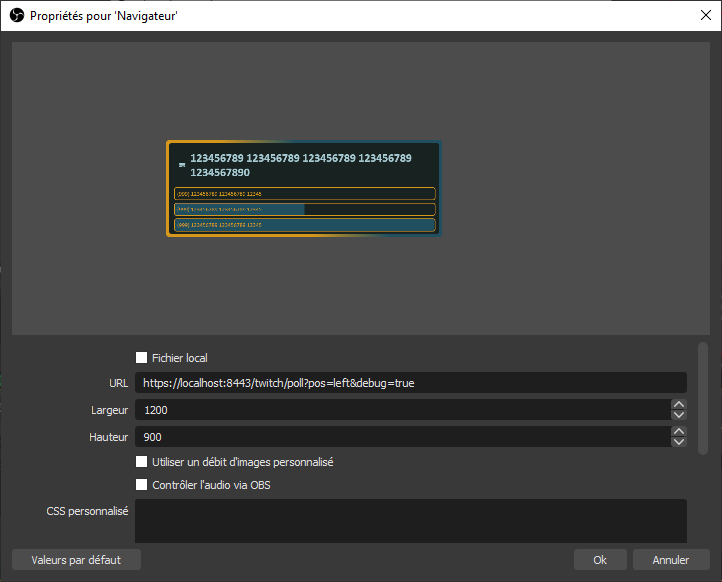

Vous pouvez également ajouter `&debug=true` à la fin de l'URL pour forcer l'affichage 
du widget avec des données de remplacement le temps de faire votre overlay. Supprimez-le
ensuite une fois que vous avez terminé

Les dimensions sont peu importantes. Le fond étant transparent, vous pourrez placer 
le widget facilement sur vos scènes.

Le widget est chargé et se met à jour automatiquement !

## Ajout du widget Twitch Prediction à OBS
Dans OBS, ajoutez une source Navigateur.  

En fonction de la manière selon laquelle vous souhaitez que le widget grandisse utilisez
l'URL suivante correspondante :
- Dans toutes les directions : `https://localhost:8443/twitch/prediction?pos=center`
  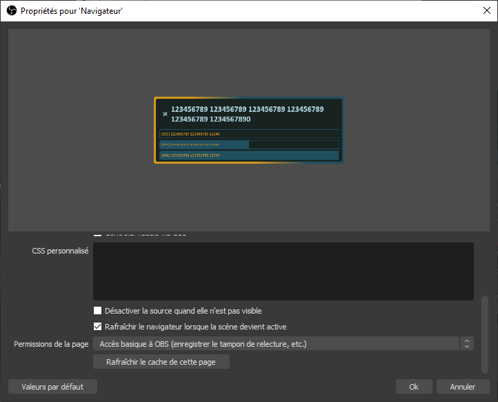
- Collez en haut et grandis en bas : `https://localhost:8443/twitch/prediction?pos=top`
  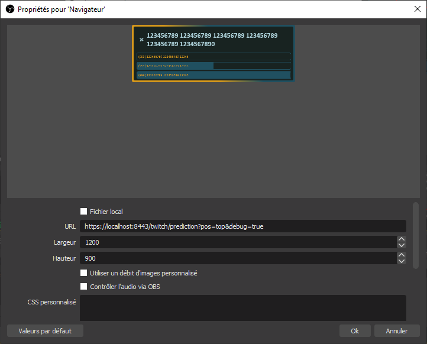
- Collez à droite et grandis vers la gauche : `https://localhost:8443/twitch/prediction?pos=right`
  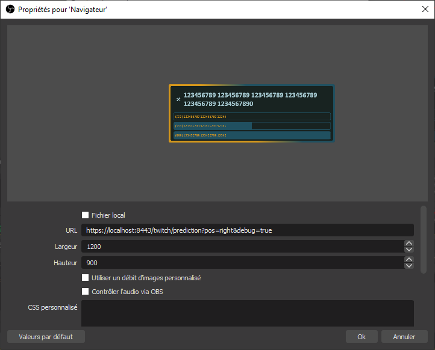
- Collez en bas et grandis en haut : `https://localhost:8443/twitch/prediction?pos=bottom`
  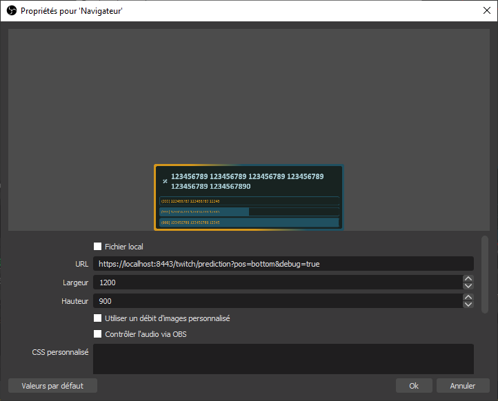
- Collez à gauche et grandis vers la droite : `https://localhost:8443/twitch/prediction?pos=left`
  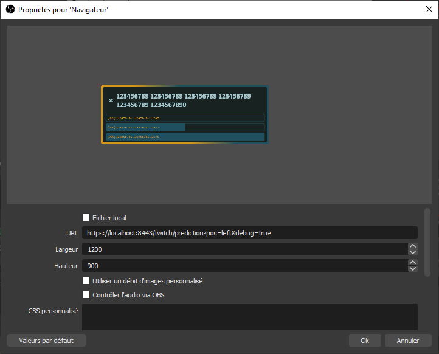

Vous pouvez également ajouter `&debug=true` à la fin de l'URL pour forcer l'affichage 
du widget avec des données de remplacement le temps de faire votre overlay. Supprimez-le
ensuite une fois que vous avez terminé

Les dimensions sont peu importantes. Le fond étant transparent, vous pourrez placer 
le widget facilement sur vos scènes.

Le widget est chargé et se met à jour automatiquement !

## Troubleshooting
Si le widget ne réagit pas, vérifiez votre channel ID. Si vous venez de le changer, redémarrez StreamerTools.