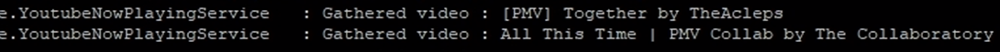
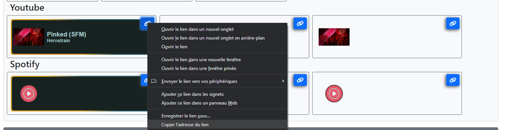
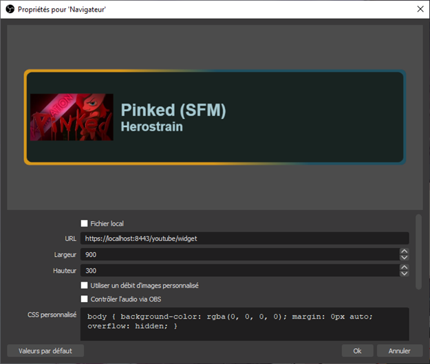
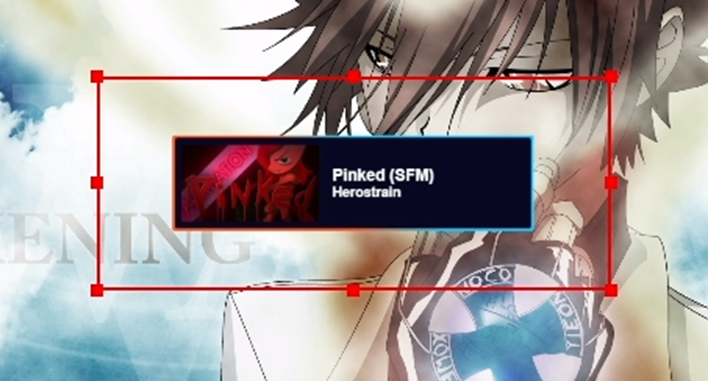
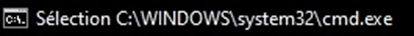

# Youtube
Démarrez une video Youtube. L'userscript Youtube Adverter va surveiller le lien de la vidéo pour transmettre toutes les
secondes l’identifiant de la vidéo à Streamer Tools.

Si plusieurs onglets Youtube sont actifs, Streamer Tools va s’associer au premier diffusant une vidéo et rester associé
jusqu’à qu’il soit fermé ou qu’il ne présente plus une vidéo (recherche, accueil...)

Chaque changement de vidéo est journalisé dans l’invite de commande de Streamer Tools.  

 
## Obtenir une clé d’API Youtube
Vous pouvez suivre ce tutoriel pour enregistrer votre version de StreamerTools et obtenir une clé d’API Youtube.

https://www.sebastiencoenon.fr/blog/nouveautes/52-creation-d-une-cle-api-youtube

Enregistrez la clé d’api dans les paramètres de StreamerTools.

## Ajout du widget Youtube-NP à OBS
Dans OBS, ajoutez une source Navigateur.  

  	
Depuis la page d’accueil de Streamer Tools, récupérez le lien de la version du widget Youtube qui vous convient. Et 
collez son URL dans la source OBS.  

Utilisez des dimensions supérieures à 900x300.  

Le widget est chargé et se met à jour automatiquement !  

## Troubleshooting
En cas de problèmes, vérifiez que le service Streamer Tools soit bien démarré.

Si c’est le cas, vérifiez que lors d’un changement de vidéo, une trace apparaît dans l’interface de Streamer Tools.

Si rien ne bouge, vérifiez que l’interface ne soit pas en mode sélection. (Sélection dans le nom de la fenêtre, 
rectangle blanc au milieu de la fenêtre). Le mode Sélection n’empêche pas le bon fonctionnement du service, mais empêche
l’affichage de nouvelles traces. Pour en sortir, appuyer sur Entrée sur votre clavier.  

    
Streamer Tools se base sur le lien dans la barre d’adresse pour extraire les méta donnés de la vidéo en cours de 
lecture. Par conséquent, le widget ne détectera pas les vidéos lues depuis l’accueil ou la recherche Youtube, en bas à 
droite de la page.
